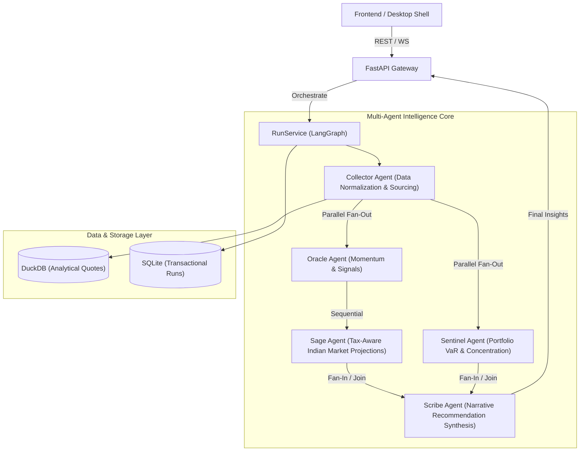

# <p align="center"></p>

<p align="center">
  <a href="#"></a>
  <a href="#"></a>
  <a href="#"></a>
  <a href="#"></a>
  <a href="#"></a>
  <a href="#"></a>
  <a href="#"></a>
  <a href="#"></a>
</p>

---

## 🔮 Overview

**Aletheia** is a local-first, open-source, multi-agent financial intelligence platform specifically tailored for the **Indian stock and crypto markets**. It runs local LLMs (via Ollama) alongside heuristic mathematical engines to gather data, assess risk, calculate tax drag, and synthesize actionable market insights—all while maintaining complete data privacy on your local machine.

The architecture separates the authoritative **Python/FastAPI** agentic core, high-performance calculations written in **Rust/PyO3**, and a beautiful **React/Vite** frontend packaged inside a **Tauri desktop shell**.

---

## 🚧 Project Status & Roadmap

> [!IMPORTANT]
> **Aletheia is currently under active development.** 
> While the multi-agent orchestration engine is fully functional as a local API and CLI, the user-facing web and desktop interfaces are currently undergoing layout scaffolding. Full step-by-step installation guides and binary packages are **Coming Soon**.

### Current Development Progress: Phase 2 of 5 — Engine Foundations ✅

All five core intelligence agents (Collector, Oracle, Sentinel, Sage, and Scribe) are implemented and wired through a LangGraph orchestration pipeline with local SQLite/DuckDB persistence.

| Phase | Component | Focus | Status |
| :---: | :--- | :--- | :---: |
| **1** | **Skeleton & Data Layer** | Monorepo layout, Pydantic schema validation, Data providers (yfinance/CCXT) | ✅ Done |
| **2** | **Engine Foundations** | LangGraph orchestration, heuristic agents, Rust/PyO3 math backend | ✅ Done |
| **3** | **Rich Frontend & Live Streaming** | React Tailwind UI, WebSocket agent reasoning stream visualization | 🔲 *Next up* |
| **4** | **LLM Integration** | Ollama local model support, prompt synthesis, CLI wizard | ✅ Done (Basic) |
| **5** | **Production Hardening** | Encryption at rest, PDF reports, Docker/K8s deployment | 🔲 Planned |

---

## 🖥️ Preview (UI Coming Soon)

Below is a preview of the upcoming Aletheia analytics dashboard, showcasing portfolio composition, capital gains tax drag projection, risk profile gauges, and real-time agent output streaming.

<p align="center">
  
</p>

---

## 📐 Multi-Agent Orchestration Flow

Aletheia uses a concurrent/sequential pipeline built on **LangGraph** where agents collaborate to analyze a portfolio:



---

## 🧠 Meet the Agents

Aletheia orchestrates five specialized agents to process and analyze stock portfolio holdings:

1. **📥 The Collector Agent**
   Normalizes tickers (NSE/BSE formats), fetches market quotes via a provider chain fallback (Static Seed ➔ yfinance ➔ CCXT), and stores analytical history in DuckDB.
2. **📈 The Oracle Agent**
   Analyzes market momentum, computes trend signals, and issues initial directional views (BUY / HOLD / REDUCE) with associated confidence scores.
3. **🛡️ The Sentinel Agent**
   Evaluates portfolio-level risk metrics, including holding concentration, market regime, and parametric Value-at-Risk (VaR95).
4. **🌾 The Sage Agent**
   Runs tax-aware scenario projections. It incorporates Indian tax rules (e.g., Short-Term vs. Long-Term Capital Gains rules for equities) to calculate tax drag on future returns.
5. **✍️ The Scribe Agent**
   Synthesizes the findings of the Oracle, Sentinel, and Sage, detects disagreements, and generates a structured narrative report with recommendations.

---

## 🛠️ Architecture & Tech Stack

- **Backend:** Python 3.11+, FastAPI, LangGraph, Pydantic v2
- **Performance:** Rust, PyO3 bindings (for portfolio risk and tax calculations)
- **Database:** SQLite (system state/runs), DuckDB (analytical market data)
- **Frontend:** React 19, TypeScript, Vite
- **Desktop Wrapper:** Tauri v2
- **Local LLM:** Ollama (defaulting to Llama-3/Qwen)

---

## 📋 Developer CLI Quick Look

For developers looking to inspect the engine locally, the CLI provides access to setup and execution:

```powershell
# Run a portfolio analysis directly from the API endpoint
POST /api/v1/runs
{
  "prompt": "Analyze an India-first starter portfolio",
  "portfolio": {
    "name": "Starter",
    "holdings": [
      { "symbol": "RELIANCE", "quantity": 5, "average_price": 2500, "asset_type": "equity", "exchange": "NSE", "tax_profile": "equity" },
      { "symbol": "TCS", "quantity": 3, "average_price": 3700, "asset_type": "equity", "exchange": "NSE", "tax_profile": "equity" }
    ]
  }
}
```

Detailed developer onboarding docs, architecture decision records (ADRs), and component-level designs are located in the [docs/](docs/) folder.

---

## ⚖️ License

Aletheia is open-source software licensed under the MIT License. See [LICENSE](LICENSE) for details (coming soon).
