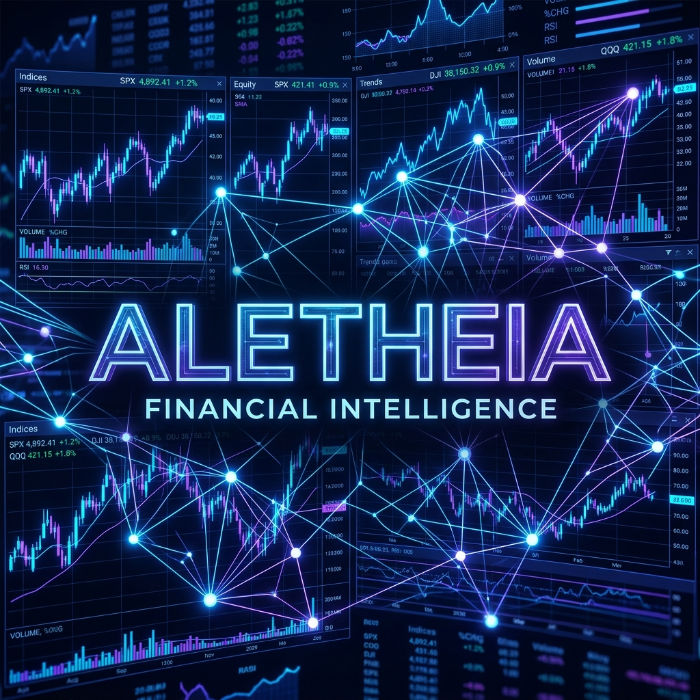
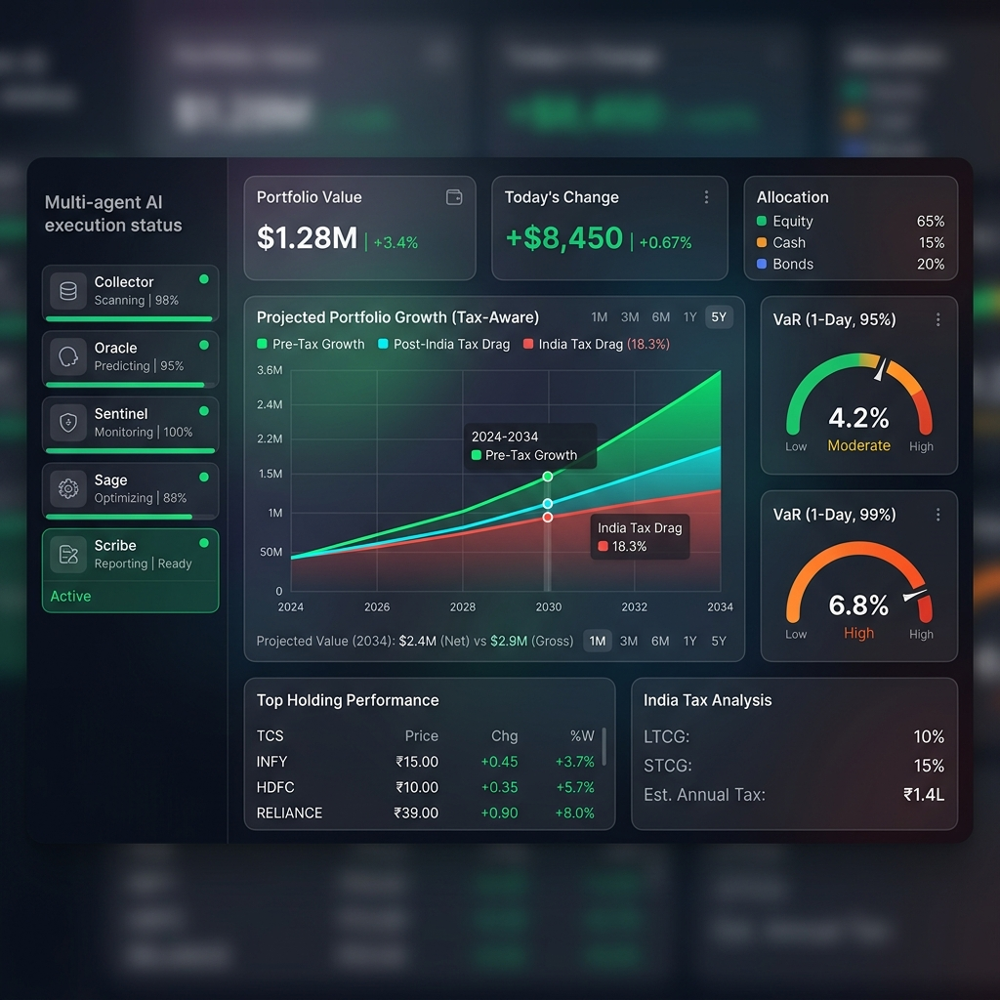
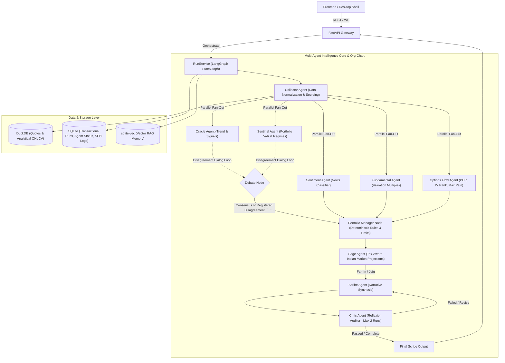

# <p align="center"></p>

<p align="center">
  <a href="#"></a>
  <a href="#"></a>
  <a href="#"></a>
  <a href="#"></a>
  <a href="#"></a>
  <a href="#"></a>
  <a href="#"></a>
  <a href="#"></a>
</p>

---

## 🔮 Overview

**Aletheia** is a local-first, open-source, multi-agent financial intelligence platform specifically tailored for the **Indian stock and crypto markets**. It runs local LLMs (via Ollama) alongside heuristic mathematical engines to gather data, assess risk, calculate tax drag, and synthesize actionable market insights—all while maintaining complete data privacy on your local machine.

The architecture separates the authoritative **Python/FastAPI** agentic core, high-performance calculations written in **Rust/PyO3**, and a beautiful **React/Vite** frontend packaged inside a **Tauri desktop shell**.

---

## 🚧 Project Status & Roadmap

> [!IMPORTANT]
> **Aletheia is currently under active development.** 
> The multi-agent orchestration engine is fully functional as a local API and CLI with comprehensive unit/integration test suites (75+ tests passing 100%). The web/desktop frontend layouts are being wired to the new endpoints.

### Development Progress: Sprint 2.5 & Sprint 3.5 Completed ✅

All nine intelligence agents, structured debate loops, deterministic Portfolio Manager limits, vector memories, and SEBI compliance logs are fully implemented and running locally.

| Phase | Component | Focus | Status |
| :---: | :--- | :--- | :---: |
| **1** | **Skeleton & Data Layer** | Monorepo layout, Pydantic schema validation, Data providers (yfinance/CCXT) | ✅ Done |
| **2** | **Engine Foundations** | LangGraph orchestration, heuristic agents, Rust/PyO3 math backend | ✅ Done |
| **2.5** | **Resilience & Org-Chart** | Per-node timeouts, partial-failure tolerance, Pydantic role contracts, Debate/PM node | ✅ Done |
| **3** | **Rich Frontend & Live Streaming** | React Tailwind UI, WebSocket agent reasoning stream visualization | 🔲 *Next up* |
| **3.5** | **Intelligence Upgrade** | sqlite-vec RAG vector memory, news sentiment classifier, options chain metrics, Scribe-Critic loop | ✅ Done |
| **4** | **LLM Integration** | Ollama local model support, prompt synthesis, CLI wizard | ✅ Done (Basic) |
| **5** | **Production Hardening** | Encryption at rest, PDF reports, Docker/K8s deployment | 🔲 Planned |

---

## 🖥️ Preview (UI Coming Soon)

Below is a preview of the upcoming Aletheia analytics dashboard, showcasing portfolio composition, capital gains tax drag projection, risk profile gauges, and real-time agent output streaming.

<p align="center">
  
</p>

---

## 📐 Multi-Agent Orchestration Flow

Aletheia uses a concurrent/sequential pipeline built on **LangGraph** where agents collaborate to analyze a portfolio:



---

## 🏛️ Agent Org-Chart Discipline

To enforce institutional-grade risk management and prevent LLM hallucinations from bypassing guidelines, Aletheia implements a strict Pydantic role contract layout using class-level `__init_subclass__` and runtime `model_validator` methods:

| Role Contract | Base Class | Enabled Agents | Mandate Rules |
| :--- | :--- | :--- | :--- |
| **Analyst** | `AnalystContract` | Collector, Oracle, Sentiment, Fundamental, OptionsFlow | May only emit raw quotes, signals, and confidence scores. **Forbidden from generating recommendations or decisions.** |
| **Risk / Constraint** | `RiskConstraintContract` | Sentinel, Sage | Applies exposure, VaR, and tax drag constraints. **Forbidden from producing recommendations or final synthesis.** |
| **Synthesis** | `SynthesisContract` | Scribe | Consolidates all inputs into final narrative and flags unresolved disagreements. **Forbidden from introducing raw, unvalidated market data.** |

---

## 🧠 Meet the Agents

1. **📥 The Collector Agent** (Analyst)
   Normalizes tickers (NSE/BSE formats), fetches market quotes via a provider chain fallback, and logs provenance.
2. **📈 The Oracle Agent** (Analyst)
   Analyzes market momentum across multiple timeframes (1D, 1W, 1M) and computes trend signals.
3. **📰 The Sentiment Agent** (Analyst)
   Scrapes NSE corporate announcements and MoneyControl RSS news feeds to classify sentiment (bullish/bearish).
4. **📊 The Fundamental Agent** (Analyst)
   Fetches financial multiples (P/E ratios, promoter holdings) from Yahoo Finance and public NSE indices to flags valuations.
5. **⛓️ The Options Flow Agent** (Analyst)
   Parses public NSE option chains, computing Put-Call Ratio (PCR), IV Rank, and option pain levels.
6. **🛡️ The Sentinel Agent** (Risk)
   Evaluates portfolio Value-at-Risk (VaR95) and market regimes (using high-performance PyO3 hidden Markov models).
7. **🌾 The Sage Agent** (Risk)
   Runs India-specific tax projections (STCG/LTCG rules) to calculate tax drag on future gains.
8. **✍️ The Scribe Agent** (Synthesis)
   Synthesizes agent outputs, notes gaps, and drafts reports.
9. **🕵️ The Critic Agent** (Auditor)
   Performs reflexion self-audits on the Scribe report, checking criteria alignment and requesting revisions if criteria fail.

---

## 🛡️ Resilience & Production Hardening

- **Per-Node Timeouts:** Nodes are executed within `asyncio.wait_for` wrappers to prevent network hanging.
- **Partial-Failure Handling:** Scribe produces report summaries even when individual non-critical agents fail, noting data gaps in warning headers.
- **Rate Limiting:** Protects API endpoints with token bucket rate limiters.
- **Append-Only SEBI Log:** All emitted recommendations are stored in an append-only, immutable SQLite database with triggers preventing deletions or updates.
- **AES-256 Encryption:** Encrypts API payloads and intermediate run states stored in SQLite at rest.

---

## 🛠️ Architecture & Tech Stack

- **Backend:** Python 3.11+, FastAPI, LangGraph, Pydantic v2
- **Performance:** Rust, PyO3 bindings (for portfolio optimization, HMM regimes, and tax math)
- **Database:** SQLite (system state/runs/SEBI logs), DuckDB (analytical market data), `sqlite-vec` (vector RAG memories)
- **Frontend:** React 19, TypeScript, Vite
- **Desktop Wrapper:** Tauri v2
- **Local LLM:** Ollama (defaulting to Llama-3/Qwen)

---

## 📋 Developer CLI Quick Look

For developers looking to inspect the engine locally, the API provides full endpoint access:

```bash
# Analyze a portfolio
POST /api/v1/runs
{
  "prompt": "Analyze an India-first starter portfolio",
  "portfolio": {
    "name": "Starter",
    "holdings": [
      { "symbol": "RELIANCE", "quantity": 5, "average_price": 2500, "asset_type": "equity", "exchange": "NSE", "tax_profile": "equity" }
    ]
  }
}

# Query SEBI Compliance Logs
GET /api/v1/compliance/log?limit=20

# Search Vector Memory RAG
GET /api/v1/memory/vector-search?q=Reliance
```

Detailed onboarding docs, threat models, and architectural guides are located in the [docs/](docs/) directory.

---

## ⚖️ License

Aletheia is open-source software licensed under the MIT License. See [LICENSE](LICENSE) for details.
