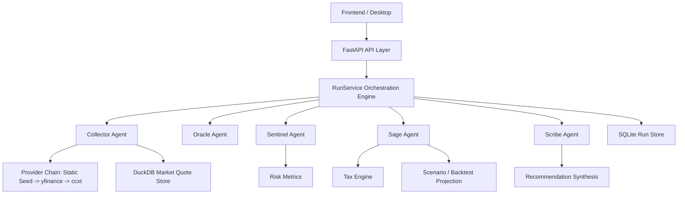

# ALETHEIA Knowledge Graph

This document is the current backend-focused handoff graph for forwarding the project into Antigravity or another agent/workstream.

## Source of Truth

- Product authority: `ALETHEIA_COMPLETE_SPEC.md`
- Implementation constraints: `CODEX_HANDOFF.md`
- Project roadmap: `docs/ROADMAP.md`
- Active repository: `C:\Aletheia`

## Current Phase: 2 of 5 — "Engine Foundations" ✅

All five agents are implemented with heuristic/rule-based logic and wired through the RunService orchestration pipeline. The backend is fully functional as an API. The frontend is a minimal scaffold that can trigger runs and display summaries.

## Current Architecture Graph

## Implemented Nodes

- `RunService`
  - orchestrates Collector, Oracle, Sentinel, Sage, and Scribe
  - records agent events for WebSocket replay
- `CollectorAgent`
  - normalizes holdings
  - resolves market data from provider chain
  - persists quote provenance
- `OracleAgent`
  - produces first-pass signal and confidence from mark-to-market and momentum
- `SentinelAgent`
  - computes concentration and VaR-style portfolio risk estimates
- `SageAgent`
  - runs a tax-aware projection scenario per holding
- `ScribeAgent`
  - synthesizes cross-agent recommendations and disagreement notes

## Stub / Placeholder Nodes (Not Yet Implemented)

- `MemoryStore` — placeholder class, no persistence or semantic search
- `ToolRegistry` — scaffold with registration/listing, no tools registered
- `LLM module` — empty directory, no Ollama client
- `Reporting module` — empty directory, no report generation
- `Utils module` — empty directory

## Implemented API Surface

| Method | Path | Description |
|--------|------|-------------|
| `GET` | `/` | Service info |
| `GET` | `/api/v1/health` | Health check with DB paths |
| `GET` | `/api/v1/health/ready` | Readiness probe |
| `POST` | `/api/v1/runs` | Create and execute a multi-agent run |
| `GET` | `/api/v1/runs` | List recent runs |
| `GET` | `/api/v1/runs/{run_id}` | Get full run result |
| `POST` | `/api/v1/portfolio-analysis` | Convenience endpoint wrapping runs |
| `WS` | `/api/v1/ws/runs/{run_id}` | Event replay (post-completion only) |

## Persistence Graph

- `SQLite`
  - stores run summaries and serialized run results
- `DuckDB`
  - stores normalized market quotes for analytical reuse

## Test Coverage

| Type | Count | Files |
|------|-------|-------|
| Unit tests | 4 | `test_collector.py`, `test_normalizer.py`, `test_risk.py`, `test_tax.py` |
| Integration tests | 1 | `test_runs_api.py` (3 test functions) |

## Demo Readiness

- Backend: **fully demo-ready** via Swagger UI or direct API calls
- Frontend: **minimal demo** — hero screen with "Create demo run" button, health display, runs list
- Desktop: **compiles** but no domain-level wiring; `cargo check` passes
- Full polished UI demo: **not yet available** (Phase 3 work)

## Immediate Next Phase: Phase 3 — Rich Frontend & Live Streaming

See `docs/ROADMAP.md` for the complete phased plan. Key priorities:

1. Design system (dark mode, components, tokens)
2. React Router multi-page layout (Dashboard, Run Detail, Portfolio, Settings)
3. Rich rendering of all agent outputs (signals, risk gauges, projections, recommendations)
4. WebSocket live streaming during run execution
5. Portfolio editor with CRUD operations
