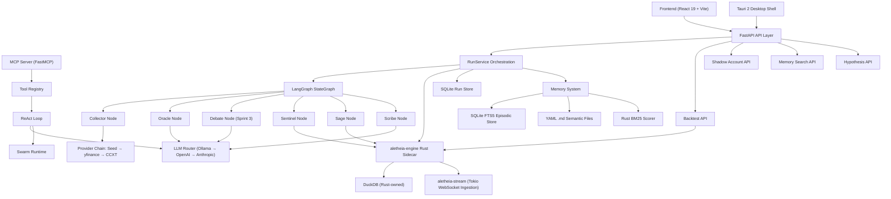

# ALETHEIA Knowledge Graph

This document is the current backend-focused handoff graph for forwarding the project into
Antigravity or another agent/workstream.

Last updated: 2026-06-26

## Source of Truth

- Project roadmap: `docs/ROADMAP.md`
- Implementation plan (detailed): `implementation_plan.md` (in agent artifact dir)
- Active repository: `C:\Aletheia`

## Current Phase: Sprint 1 — "Make It Actually Work" 🔴

The 5-agent pipeline, LangGraph StateGraph, Rust PyO3 module, and tool registry all exist as
scaffolds. Critical gaps prevent genuine usefulness: single-provider LLM, keyword-only memory,
no backtest data feed, incomplete hypothesis lifecycle. Sprint 1 closes all of these.

## Complete Architecture Graph (Target State)

## Implemented Nodes (Current State)

### Core Infrastructure
- `RunService` — orchestrates 5 agents via LangGraph, records AgentEvents for WebSocket replay
- `FastAPI` — 8 endpoints (health, runs CRUD, portfolio-analysis, WebSocket)
- `SQLite` — run summaries + serialized results
- `DuckDB` — normalized market quotes (via Python connection)

### Agent Pipeline
- `CollectorAgent` — provider fallback chain (StaticSeed → yfinance → CCXT), quote normalization
- `OracleAgent` — heuristic signal + Ollama LLM with fallback (BUY/HOLD/REDUCE)
- `SentinelAgent` — Rust-powered VaR95, concentration risk, market regime classification
- `SageAgent` — Rust-powered tax-aware scenario projection (India tax profiles)
- `ScribeAgent` — Ollama LLM synthesis + disagreement detection

### Rust Module (`aletheia_rust` PyO3)
- `assess_portfolio_risk_rust` — portfolio VaR95, concentration risk
- `build_tax_summary_rust` — tax drag calculation
- `build_scenario_rust` — projected post-tax return per holding
- `options_pricing_rust` — Black-Scholes with full Greeks (delta, gamma, theta, vega)
- `monte_carlo_var_rust` — Monte Carlo VaR (basic LCG RNG)
- `calculate_technical_indicators_rust` — SMA, EMA, RSI

### Agentic Layer
- `ReActLoop` — full Reasoning + Acting loop with streaming events
- `OllamaChatLLM` — single provider, tool calling supported
- `ToolRegistry` — auto-discovery via `__subclasses__()`, 15 tools registered
- `PersistentMemory` — file-based YAML .md storage, keyword search only
- `SwarmRuntime` — parallel worker coordinator (scaffold)
- `MCP Server` — FastMCP wrapping all registered tools

### Extensions
- `BacktestRunner` — event-driven simulation (no real data feed wired)
- `HypothesisRegistry` — proposed/testing/validated/rejected models (lifecycle incomplete)
- `BacktestMetrics` — Sharpe, Sortino, max drawdown, win rate (Python, to be Rust-ported)

## Gap Nodes (Stub / Placeholder)

| Node | Status | Sprint |
|------|--------|--------|
| `LLMRouter` (multi-provider) | ❌ Missing | Sprint 1A |
| `EpisodicMemory` (SQLite FTS5) | ❌ Missing | Sprint 1B |
| Rust `bm25_score_rust` | ❌ Missing | Sprint 1B / 2A |
| `HistoricalDataFeed` (yfinance → DuckDB) | ❌ Missing | Sprint 1C |
| Hypothesis lifecycle state machine | ⚠️ Models exist, no transitions | Sprint 1D |
| `aletheia-engine` Rust sidecar | ❌ Missing | Sprint 2B |
| `aletheia-stream` Tokio ingestion | ❌ Missing | Sprint 2C |
| `DebateOrchestrator` | ❌ Missing | Sprint 3A |
| LangSmith tracing (real, not stub) | ⚠️ Stub decorator | Sprint 3B |
| `ShadowAccount` paper trading | ❌ Missing | Sprint 3C |
| Frontend real data wire-up | ⚠️ Pages exist, mocked | Sprint 3D |
| Rust `RateLimiter` PyO3 class | ❌ Missing | Sprint 4A |
| PDF report generation | ❌ Missing | Sprint 4B |

## Implemented API Surface

| Method | Path | Status |
|--------|------|--------|
| `GET` | `/` | ✅ |
| `GET` | `/api/v1/health` | ✅ |
| `GET` | `/api/v1/health/ready` | ✅ |
| `POST` | `/api/v1/runs` | ✅ |
| `GET` | `/api/v1/runs` | ✅ |
| `GET` | `/api/v1/runs/{run_id}` | ✅ |
| `POST` | `/api/v1/portfolio-analysis` | ✅ |
| `WS` | `/api/v1/ws/runs/{run_id}` | ✅ |
| `POST` | `/api/v1/backtest` | 🔲 Sprint 1C |
| `GET` | `/api/v1/hypotheses` | 🔲 Sprint 1D |
| `POST` | `/api/v1/hypotheses` | 🔲 Sprint 1D |
| `GET` | `/api/v1/shadow/positions` | 🔲 Sprint 3C |
| `GET` | `/api/v1/runs/{id}/export` | 🔲 Sprint 4B |
| `GET` | `/api/v1/memory/search` | 🔲 Sprint 1B |

## Persistence Graph

- `SQLite` — run summaries, serialized run results, episodic memory FTS5 (Sprint 1B), shadow positions (Sprint 3C)
- `DuckDB` — normalized market quotes, historical OHLCV (Sprint 1C), Rust-owned connection pool (Sprint 2B)
- `~/.aletheia/memory/*.md` — semantic memory YAML files

## Comparison to Reference Architectures

| Capability | Vibe Trading (HKUDS) | OpenBB | Aletheia (Current) | Gap |
|---|---|---|---|---|
| Multi-agent swarm | ✅ 29 teams | ✅ Plugin routers | ⚠️ 5 fixed + swarm scaffold | Sprint 3A |
| Agent debate | ✅ Bull/Bear | ❌ | ❌ | Sprint 3A |
| Backtesting | ✅ | ✅ | ⚠️ Runner, no data | Sprint 1C |
| Memory quality | ✅ | N/A | ❌ Keyword only | Sprint 1B |
| LLM multi-provider | ✅ | ✅ | ❌ Ollama only | Sprint 1A |
| MCP integration | ❌ | ✅ Native | ⚠️ FastMCP stub | Sprint 2 |
| Rust performance core | ❌ | ⚠️ Some | ⚠️ 6 functions | Sprint 2 |
| Hypothesis lifecycle | ✅ | N/A | ⚠️ Models only | Sprint 1D |
| Observability | ✅ LangSmith | ✅ | ⚠️ Stub | Sprint 3B |
| **Overall parity** | | | **~35–40%** | |

## Test Coverage

| Type | Count | Files |
|------|-------|-------|
| Unit tests | 4 | `test_collector.py`, `test_normalizer.py`, `test_risk.py`, `test_tax.py` |
| Integration tests | 1 | `test_runs_api.py` (3 test functions) |
| Missing | — | `test_rust_compute.py`, `test_backtest.py`, `test_memory.py`, `test_llm_router.py` |

## Demo Readiness

- Backend: **fully demo-ready** via Swagger UI or direct API calls
- Frontend: **minimal demo** — hero screen with "Create demo run" button, health display, runs list
- Desktop: **compiles** but no domain-level wiring
- Full polished UI demo: **not yet available** (Sprint 3D)
