# ALETHEIA Knowledge Graph

This document is the current backend-focused handoff graph for forwarding the project into
Antigravity or another agent/workstream.

**Last updated: 2026-06-27**

---

## Source of Truth

- Project roadmap: `docs/ROADMAP.md`
- Security model: `docs/THREAT_MODEL.md`
- Competitive strategy: `docs/COMPETITIVE_ANALYSIS.md`
- Active repository: `C:\Aletheia`

---

## Current Phase: Sprint 3 — "Real Intelligence" 🔴

Sprints 1 and 2 are fully complete. The engine, Rust sidecar, multi-provider LLM router,
episodic memory (SQLite FTS5 + BM25), and historical backtest feed all exist and are wired.

Sprints leading into Sprint 3 also delivered the Agent Org-Chart Discipline (Component 6):
- Pydantic role contracts with `__init_subclass__` enforcement
- Oracle ↔ Sentinel debate node
- Portfolio Manager deterministic override node
- Configurable graph (node-skip via config flag)
- Run-level state machine (`pending → running → partial → complete → failed`) in SQLite

**The engine is solid. Sprint 3 focuses on making the system feel real and usable.**

---

## Complete Architecture Graph (Current State)

```mermaid
graph TD
    UI["Frontend (React 19 + Vite)"] --> API["FastAPI API Layer"]
    Desktop["Tauri 2 Desktop Shell"] --> API
    MCP["MCP Server (FastMCP)"] --> Tools["Tool Registry"]

    API --> Engine["RunService Orchestration"]
    API --> BacktestAPI["Backtest API ✅"]
    API --> ShadowAPI["Shadow Account API ❌"]
    API --> MemoryAPI["Memory Search API ✅"]
    API --> HypothesisAPI["Hypothesis API ✅"]
    API --> ChatAPI["Chat Stream API ✅ (ReAct/SSE)"]

    Engine --> LangGraph["LangGraph StateGraph"]
    LangGraph --> StateMachine["Run State Machine (pending→running→partial→complete→failed) ✅"]
    LangGraph --> Collect["Collector Node ✅"]
    LangGraph --> Oracle["Oracle Node ✅ (LLM + heuristic)"]
    LangGraph --> Sentinel["Sentinel Node ✅ (Rust VaR)"]
    LangGraph --> Debate["Debate Node ✅ (Oracle ↔ Sentinel disagreement)"]
    LangGraph --> PM["Portfolio Manager Node ✅ (rule-based override)"]
    LangGraph --> Sage["Sage Node ⚠️ (Rust tax, needs LLM narrative)"]
    LangGraph --> Scribe["Scribe Node ✅ (LLM synthesis + gap-noting)"]

    Collect --> Providers["Provider Chain: Seed → yfinance → CCXT"]
    Oracle --> LLMRouter["LLM Router ✅ (Ollama → OpenAI → Anthropic)"]
    Scribe --> LLMRouter
    Debate --> LLMRouter

    Engine --> RustEngine["aletheia-engine Rust Sidecar ✅"]
    Sentinel --> RustEngine
    Sage --> RustEngine
    BacktestAPI --> RustEngine

    RustEngine --> DuckDB["DuckDB (Rust-owned) ✅"]
    RustEngine --> Stream["aletheia-stream (Tokio WS Ingestion) ❌ Not started"]

    Engine --> SQLite["SQLite Run Store ✅"]
    Engine --> Memory["Memory System"]
    Memory --> EpisodicDB["SQLite FTS5 Episodic Store ✅"]
    Memory --> SemanticFiles["YAML .md Semantic Files ⚠️ keyword only"]
    Memory --> VectorDB["ChromaDB / sqlite-vec ❌ Not started"]
    Memory --> RustBM25["Rust BM25 Scorer ✅"]

    Tools --> ReActLoop["ReAct Loop ✅"]
    ReActLoop --> LLMRouter
    ReActLoop --> SwarmRuntime["Swarm Runtime ⚠️ scaffold"]
```

---

## Implemented Nodes (Current State)

### Core Infrastructure
- `RunService` — orchestrates 5 agents + debate + PM nodes via LangGraph, configurable node-skip
- `RunStateMachine` — per-run + per-agent status persisted in SQLite (`run_status`, `agent_statuses`)
- `FastAPI` — 16+ endpoints (health, runs CRUD, portfolio-analysis, WebSocket, backtest, hypotheses, memory, chat/stream, portfolios)
- `SQLite` — run summaries, serialized results, episodic FTS5, agent status table
- `DuckDB` — normalized market quotes (Python connection + Rust sidecar connection pool)

### Agent Pipeline (Configurable via `agent_config` flags)
- `CollectorAgent` — provider fallback chain (StaticSeed → yfinance → CCXT), quote normalization, DuckDB write
- `OracleAgent` — heuristic signal + Ollama/OpenAI/Anthropic LLM with fallback (BUY/HOLD/REDUCE + confidence score)
- `SentinelAgent` — Rust-powered VaR95, concentration risk, market regime classification
- `DebateNode` — re-prompts Oracle and Sentinel with each other's reasoning when they materially disagree
- `PortfolioManagerNode` — deterministic rule enforcement (exposure limits, max position size, risk floor)
- `SageAgent` — Rust-powered tax-aware scenario projection (India STCG/LTCG), thin LLM wrapper needed
- `ScribeAgent` — Ollama LLM synthesis + disagreement flag + gap-noting if any upstream agent failed

### Agent Role Contracts (Pydantic-enforced — unique vs. all peers)
- `AnalystContract` — Oracle, Collector: may NOT emit `recommendations`, `final_decision`, `executive_summary`
- `RiskConstraintContract` — Sage, Sentinel: may NOT emit `recommendations`, raw `quotes`
- `SynthesisContract` — Scribe: may NOT emit raw `quotes`
- Violation at class-definition time raises `TypeError`. Violation at runtime raises `ValueError`.

### Rust Module (`aletheia_rust` PyO3) — 30+ functions
- Technical: `calculate_macd_rust`, `calculate_bollinger_bands_rust`, `calculate_atr_rust`,
  `calculate_stochastic_rust`, `calculate_vwap_rust`, `calculate_obv_rust`,
  `calculate_technical_indicators_rust` (SMA, EMA, RSI)
- Portfolio: `assess_portfolio_risk_rust` (VaR95, concentration), `portfolio_optimization_rust` (mean-variance),
  `monte_carlo_var_rust`, `monte_carlo_portfolio_paths_rust`, `correlation_matrix_rust`,
  `rolling_correlation_rust`, `covariance_matrix_rust`
- Performance: `calculate_sharpe_rust`, `calculate_sortino_rust`, `calculate_calmar_rust`,
  `calculate_max_drawdown_rust`
- Pricing: `options_pricing_rust` (Black-Scholes, full Greeks: delta, gamma, theta, vega, rho)
- Tax: `build_tax_summary_rust`, `build_scenario_rust`
- Utility: `bm25_score_rust`, `RateLimiter` (token bucket, thread-safe)

### Rust Sidecar (`aletheia_engine`) — Tokio HTTP on :18899
- `POST /compute/indicators` — full indicator suite (Rust, no GIL)
- `POST /compute/portfolio-optimization`
- `POST /compute/monte-carlo`
- `POST /ingest/quotes` — bulk DuckDB insert
- `GET /query/quotes` — time-range query
- Python `ComputeClient` — async HTTP wrapper with PyO3 fallback

### LLM Layer
- `OllamaChatLLM` — local, tool calling supported
- `OpenAIChatLLM` — tool calling, structured output
- `AnthropicChatLLM` — tool calling
- `LLMRouter` — priority list, retry, circuit breaker, token cost tracking per call

### Memory System
- `EpisodicMemory` — SQLite FTS5 full-text search over run history, auto-ingest after each run
- `PersistentMemory` — YAML .md semantic files (keyword search only — needs vector upgrade)
- `bm25_score_rust` — relevance ranking for episodic search results

### Agentic Layer
- `ReActLoop` — full Reasoning + Acting loop with SSE streaming
- `ToolRegistry` — auto-discovery via `__subclasses__()`, 15 tools registered
- `SwarmRuntime` — parallel worker coordinator (scaffold, not production-ready)
- Swarm presets: `investment_team`, `quant_team`
- MCP server via FastMCP (wraps all registered tools)

### Extensions
- `BacktestRunner` — event-driven simulation wired to `HistoricalDataFeed` (yfinance → DuckDB)
- `HypothesisRegistry` — proposed/testing/validated/rejected state machine + backtest link
- `BacktestMetrics` — Sharpe, Sortino, Calmar, max drawdown, win rate (Python, to be Rust-ported)
- `ShadowAccount` — models exist (`VirtualPosition`, `VirtualOrder`), storage exists, API NOT wired
- `LocalImporter` — CSV/Parquet/DuckDB ingest into unified DuckDB store
- Broker connectors: `Zerodha` blueprint, `TradingView` webhook blueprint (blueprints, not live)

### Security Layer
- Fernet AES-256 encryption on SQLite sensitive columns (`holdings_json`, `result_json`, `payload_json`)
- DuckDB AES-256-GCM encryption via `encryption_key`
- X-API-Key header authentication + rate limiting (Rust token-bucket via PyO3)
- Input validation via Pydantic regex constraints on all user-supplied fields
- `.env` vs `.env.example` enforcement in CI
- `pip-audit`, `cargo audit`, `npm audit --audit-level=high` in GitHub Actions CI
- High-entropy API key pattern scan on every commit diff

---

## Gap Nodes (Stub / Placeholder / Missing)

| Node | Status | Sprint |
|------|--------|--------|
| `aletheia-stream` Tokio WS ingestion (Binance, NSE) | ❌ Not started | Sprint 3A |
| Frontend Dashboard — real WS stream | ⚠️ Pages exist, all mocked | Sprint 3B |
| Frontend Portfolio CRUD — real API | ⚠️ Exists, not wired | Sprint 3B |
| `ShadowAccount` API endpoints | ❌ Model exists, not wired | Sprint 3C |
| LangSmith tracing (real, not stub) | ⚠️ Stub decorator | Sprint 3D |
| Vector memory (ChromaDB / sqlite-vec) | ❌ Not started | Sprint 3.5 |
| Sage LLM narrative enrichment | ⚠️ Rust-only, no LLM prose | Sprint 3.5 |
| Sentinel LLM commentary | ⚠️ Numbers only | Sprint 3.5 |
| LLM token streaming to frontend | ❌ Not started | Sprint 3.5 |
| PDF report generation (WeasyPrint) | ❌ Not started | Sprint 4A |
| `GET /api/v1/runs/{id}/export` | ❌ Not started | Sprint 4A |
| Tauri backend auto-launch (sidecar pattern) | ❌ Not wired | Sprint 4B |
| Prometheus `/metrics` endpoint | ❌ Not started | Sprint 4C |
| Full MCP server (not FastMCP stub) | ⚠️ FastMCP exists | Sprint 4C |
| NSE/BSE specific signals (FII/DII, circuit breakers) | ❌ Not started | Sprint 5 |
| Domain fine-tuned local LLM (`aletheia-7b`) | ❌ Not started | Sprint 5 |
| Multi-swarm specialist teams (crypto, macro) | ⚠️ Swarm scaffold only | Sprint 5 |

---

## Implemented API Surface

| Method | Path | Status |
|--------|------|--------|
| `GET` | `/` | ✅ |
| `GET` | `/api/v1/health` | ✅ |
| `GET` | `/api/v1/health/ready` | ✅ |
| `POST` | `/api/v1/runs` | ✅ |
| `GET` | `/api/v1/runs` | ✅ |
| `GET` | `/api/v1/runs/{run_id}` | ✅ |
| `GET` | `/api/v1/runs/{run_id}/events` | ✅ |
| `WS` | `/api/v1/ws/runs/{run_id}` | ✅ |
| `POST` | `/api/v1/portfolio-analysis` | ✅ |
| `GET/POST/DELETE` | `/api/v1/portfolios` | ✅ |
| `POST` | `/api/v1/backtest` | ✅ (runner + real data feed) |
| `GET` | `/api/v1/backtest/{id}` | ✅ |
| `GET/POST` | `/api/v1/hypotheses` | ✅ |
| `GET` | `/api/v1/hypotheses/{id}` | ✅ |
| `PATCH` | `/api/v1/hypotheses/{id}/transition` | ✅ |
| `POST` | `/api/v1/hypotheses/{id}/evidence` | ✅ |
| `GET` | `/api/v1/memory/search` | ✅ |
| `POST` | `/api/v1/chat/stream` | ✅ (SSE) |
| `GET` | `/api/v1/shadow/positions` | ❌ Sprint 3C |
| `POST` | `/api/v1/shadow/trade` | ❌ Sprint 3C |
| `GET` | `/api/v1/runs/{id}/progress` | ❌ Sprint 3D |
| `GET` | `/api/v1/runs/{id}/export` | ❌ Sprint 4A |

---

## Persistence Graph

- `SQLite` — run summaries, serialized results, agent status table, episodic FTS5 memory, hypothesis registry, shadow positions (Sprint 3C)
- `DuckDB` — normalized market quotes, historical OHLCV, Rust-owned connection pool
- `~/.aletheia/memory/*.md` — semantic YAML files (keyword search, to be replaced by vector store)
- `~/.aletheia/memory/episodic.db` — FTS5 episodic store

---

## Competitive Positioning

| Unique Differentiator | Status | Peer Gap |
|---|---|---|
| Pydantic role contracts (type-safe agent mandates) | ✅ Done | None in peers |
| India STCG/LTCG tax engine (Rust) | ✅ Done | None in peers |
| Partial-failure resilience + gap-noting Scribe | ✅ Done | None in peers |
| Portfolio Manager deterministic override | ✅ Done | None in peers |
| Rust sidecar (zero-GIL compute path) | ✅ Done | None in peers |
| Agent debate / disagreement node | ✅ Done | Vibe-Trading (different approach) |
| Configurable graph (node-skip via config) | ✅ Done | Vibe-Trading skill system (similar) |

**Overall parity vs. best-in-class (Vibe-Trading): ~55-60%**
The engine's architecture quality exceeds Vibe-Trading in several dimensions.
The experience layer (live data, frontend, paper trading) is what remains.

---

## Test Coverage

| Type | Count | Files |
|------|-------|-------|
| Unit tests | 6 files | `test_collector.py`, `test_normalizer.py`, `test_risk.py`, `test_tax.py`, `test_rust.py`, `test_encryption.py` |
| Integration tests | 6 files | `test_agent_org_chart.py` (60 tests), `test_runs_api.py`, `test_agent_golden.py`, `test_partial_failures.py`, `test_error_handling.py`, `test_sqlite_concurrency.py` |
| Other | 2 files | `test_rust_compute.py`, `test_local_importer.py`, `test_compute_client.py` |
| Missing | — | LLM router mock tests, live provider mocks, backtest integration, frontend Playwright |

---

## Demo Readiness

- Backend: **fully demo-ready** via Swagger UI or direct API calls
- Frontend: **scaffold demo** — pages exist but all data is mocked
- Desktop (Tauri): **compiles** but no domain-level wiring
- Full polished UI demo with live data: **not yet available** (Sprint 3B)
- Paper trading demo: **not yet available** (Sprint 3C)
