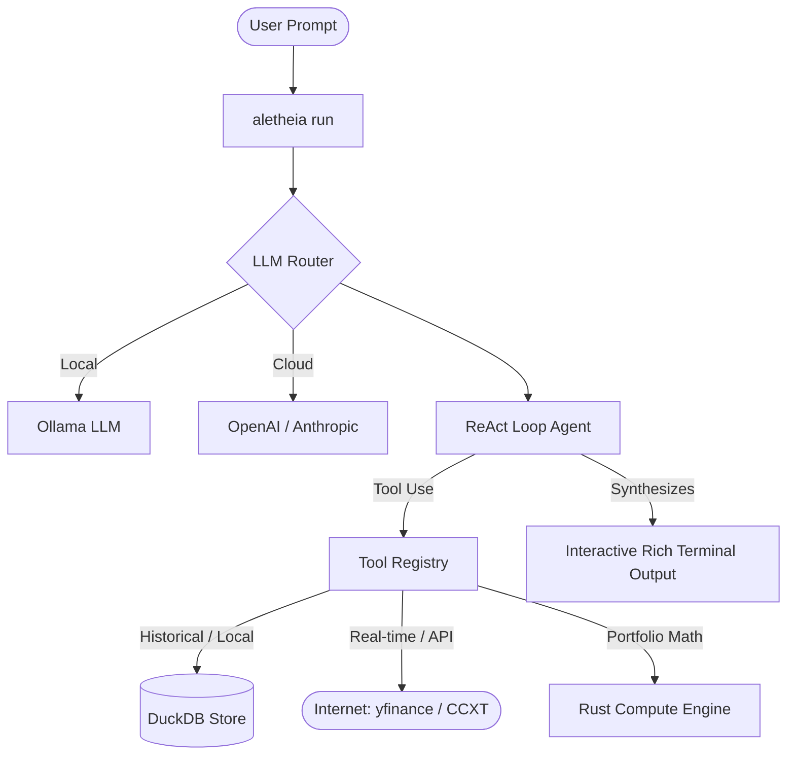

# Aletheia User Guide & Integration Manual

Welcome to **Aletheia**, a terminal-first, agentic trading and financial intelligence framework. This guide details how the framework operates, how to configure broker connectors, how to ingest local data, and how to execute natural language tasks locally or via cloud resources.

---

## 1. Core Architecture & Philosophy

Aletheia is designed to translate high-level, natural language financial prompts into precise quantitative workflows. It adopts a **Reasoning + Acting (ReAct)** pattern similar to advanced quantitative research agents like **HKUDS/Vibe-Trading**.



### Key Stages:
1. **Route**: The `LLMRouter` determines the best available model (falling back from OpenAI/Anthropic to local Ollama if offline).
2. **Ground**: The agent queries its semantic memory, retrieves historical data from the local DuckDB store, or queries the web.
3. **Compute & Test**: Critical math (RSI, Bollinger Bands, Monte Carlo, Sharpe/Sortino) is processed in a high-performance **Rust Sidecar Engine** for safety and speed.
4. **Deliver**: The agent outputs structured thoughts, tool execution logs, and a final markdown synthesis in the terminal.

---

## 2. Internet Access & Running Locally (Offline Mode)

Aletheia is built with a **local-first** approach. You can run the entire stack completely offline with zero data leakage.

### A. LLMs: Local vs. Cloud
* **Offline Mode (Default)**: Aletheia connects to **Ollama** running locally on your machine (`http://127.0.0.1:11434`). It utilizes open-source models like `mistral:7b`, `llama3`, or `phi3`.
* **Online Mode**: You can configure OpenAI (`gpt-4o-mini`) or Anthropic (`claude-haiku-4-5`) in the `.env` file for higher intelligence and complex strategy reasoning.

### B. Market Data: Local vs. Online
* **Online Mode**: If you request data for standard tickers (e.g. `AAPL`, `RELIANCE.NS`), Aletheia uses `yfinance` or `CCXT` to download market data over the internet and caches it.
* **Offline Mode**: By prefixing symbols with `local:` (e.g. `local:MY_TICKER`) or importing custom files, Aletheia bypasses all internet calls and retrieves data strictly from the local **DuckDB** database.

---

## 3. Importing Custom Data

Aletheia supports importing historical data from standard industry formats: **CSV, Parquet, and DuckDB**.

### Ingestion Command
To ingest a data file under a specific symbol name, use the `import-data` command:
```bash
.venv\Scripts\python.exe -m aletheia.cli.main import-data --symbol MY_STOCK --file ./path/to/data.csv
```

### Auto-Column Mapping
The importer automatically normalizes common column headers. You do not need to rename your columns if they match standard conventions:
* **Date**: `date`, `timestamp`, `time`, `trade_date`, `datetime`
* **Open**: `open`, `open_price`, `opening`
* **High**: `high`, `high_price`, `highest`
* **Low**: `low`, `low_price`, `lowest`
* **Close**: `close`, `close_price`, `closing`
* **Volume**: `volume`, `vol`, `turnover`

### Custom Mapping & SQL Ingestion
If your file has non-standard columns or is an external DuckDB database, specify a custom column mapping or SQL query:
```bash
# Specifying manual column mapping
.venv\Scripts\python.exe -m aletheia.cli.main import-data -s MY_STOCK -f ./data.csv --date-format "%Y-%m-%d"

# Querying a specific table from an external DuckDB database
.venv\Scripts\python.exe -m aletheia.cli.main import-data -s MY_STOCK -f ./external.duckdb --query "SELECT datetime as date, open, high, low, close, volume FROM daily_prices"
```

---

## 4. Linking Broker Accounts

Aletheia includes standardized blueprints to bridge research strategies to live broker accounts or external trading triggers.

### A. Zerodha Kite Connect (Indian Equities)
Located in [zerodha.py](file:///c:/Aletheia/aletheia/extensions/brokers/zerodha.py), the `ZerodhaKiteConnector` uses the official Kite Connect SDK.

#### Setup:
1. Install dependencies:
   ```bash
   .venv\Scripts\python.exe -m pip install kiteconnect
   ```
2. Configure your API key and Access Token in your environment or instantiate the connector:
   ```python
   from aletheia.extensions.brokers.zerodha import ZerodhaKiteConnector

   connector = ZerodhaKiteConnector(api_key="your_api_key", access_token="your_access_token")
   # Now the agent can check margins, get positions, or place orders
   balance = await connector.get_account_balance()
   ```

### B. TradingView Webhooks
Located in [tradingview.py](file:///c:/Aletheia/aletheia/extensions/brokers/tradingview.py), the `TradingViewSignalRouter` listens for incoming JSON webhook alerts from TradingView charts.

#### Webhook Alert Schema:
Set your TradingView alert message body to the following JSON format:
```json
{
  "passphrase": "your_secure_passphrase_configured_in_env",
  "symbol": "RELIANCE",
  "action": "buy",
  "quantity": 10,
  "price": 2500.50,
  "strategy": "RSI-Crossover"
}
```
The signal router verifies the passphrase, runs basic risk bounds (e.g. max order quantity), and executes the order through the configured broker connector.

---

## 5. Running Natural Language Tasks via CLI (`aletheia run`)

The `run` command allows you to write natural language queries directly. The agent figures out which tools to use and how to aggregate the results.

### Terminal Usage:
```bash
.venv\Scripts\python.exe -m aletheia.cli.main run "Analyze the technical indicators of local:MY_STOCK. Is the RSI indicating an oversold condition?"
```

### Example Tasks:
* **Backtesting**: `"Run an SMA crossover backtest on local:MY_STOCK using a 50-day fast and 200-day slow window. Return the Sharpe and Sortino ratios."`
* **Analysis**: `"Is RELIANCE.NS showing a bullish divergence on MACD?"`
* **Synthesis**: `"Compare the volatility and max drawdown of AAPL and MSFT over the last year."`

---

## 6. Development & Workarounds (Windows Guidelines)

When writing code or running compilers in this workspace, follow the rules defined in [.agents/AGENTS.md](file:///c:/Aletheia/.agents/AGENTS.md):
1. **Windows Defender Lockups**: Windows Defender may lock temporary compilation files in the Rust cargo target folder (`aletheia_engine/target`). If a build fails with `os error 32`, delete the target folder manually.
2. **PyO3 Site-Packages Overwrite**: If Maturin is locked, kill running Python processes before rebuilding.
3. **Explicit Python Execution**: Always prefix commands with `.venv\Scripts\python.exe` or `.venv\Scripts\pytest` to keep within the workspace virtual environment.
